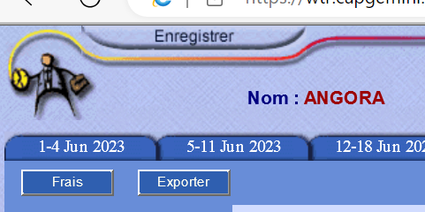

# ASE-kangora-wkone ( RoboML DSL)

## Overview

Welcome to the RoboML DSL project! This project involves creating a Domain-Specific Language (DSL) for defining the behavior of a small robot. The DSL includes modeling the domain, implementing tooling such as a text editor, an interpreter (for a web-based simulator), and a compiler (for Arduino code).

### Domain Modeling with Ecore

In the first part of the project, we defined the language's metamodel using Ecore, which captures the abstract syntax of the DSL. The key concepts modeled include movement, rotation, speed, sensors, units, basic arithmetic, boolean expressions, control structures, functions, and variables.

Below is an example of the Ecore metamodel:

In this metamodel, classes such as `Movement`, `Rotation`, `Speed`, `Sensors`, etc., capture the essential concepts of the RoboML language.

## Textual Modeling with Langium

The second part focuses on defining the Langium grammar and editor for the DSL. We used the TypeScript-based Langium workbench to build a Visual Studio Code extension. This extension allows users to edit RoboML code with syntax highlighting and autocompletion.

### Interpreting RoboML Code

The interpreter is implemented in TypeScript and runs on a web-based simulator for the robot. It utilizes the visitor design pattern to traverse the Abstract Syntax Tree (AST) generated from parsed RoboML code. The interpreter simulates the robot's behavior according to the code.

### Compiling RoboML Code

The compiler translates RoboML code into Arduino code, enabling the robot to execute the specified behavior. Similar to the interpreter, the compiler uses the visitor pattern to traverse the AST and generate Arduino-compatible code.

## Demo

Watch a demo of the RoboML DSL project in action [here](link/to/demo/video).

## Summary and Challenges

In summary, this project involved creating a DSL for robot behavior, including domain modeling, textual modeling, interpretation, and compilation. Challenges encountered during development included...

- Challenge 1
- Challenge 2
- ...

Feel free to explore the project, try out the DSL, and contribute to its improvement!

**Note:** Add any specific instructions or additional details based on your project's unique aspects.
