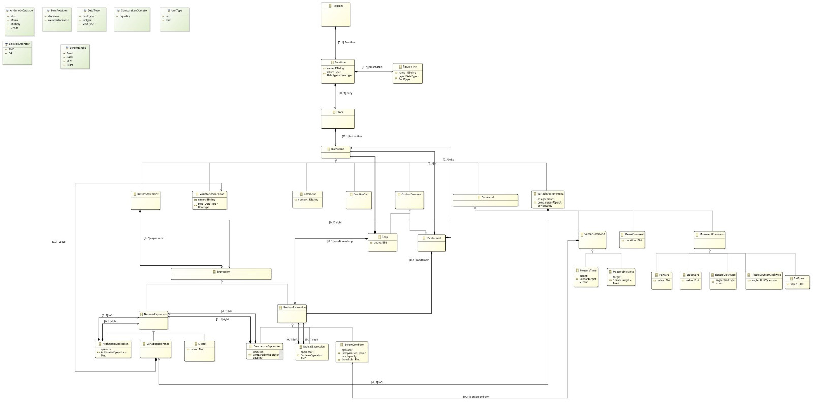
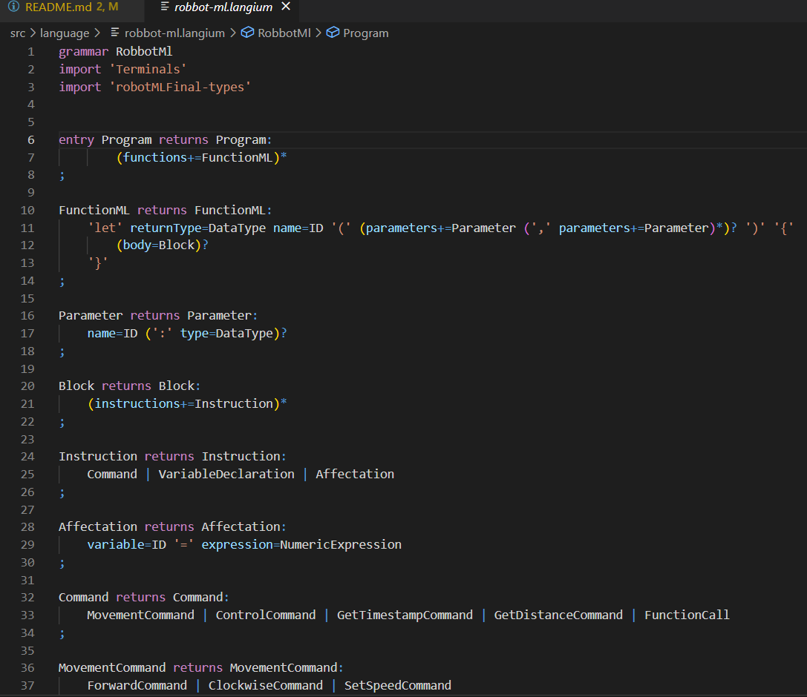
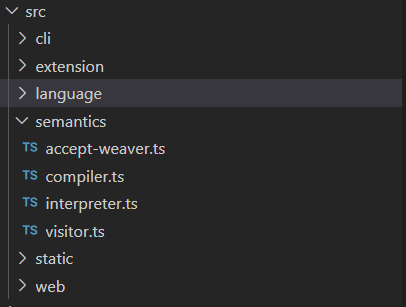

# ASE-kangora-wkone (RoboML DSL)

## Overview

The ASE-kangora-wkone project is dedicated to crafting a Domain-Specific Language (DSL) for delineating the behavior of a small robot. This encompassing DSL endeavor spans domain modeling, intricate tooling implementation, featuring a text editor, an interpreter employing a web-based simulator, and a compiler generating Arduino code.

### Domain Modeling with Ecore

In the project's inaugural phase, we meticulously constructed the language's metamodel utilizing Ecore, offering a nuanced abstraction of the DSL's abstract syntax.

#### 1. **Program:**
Represents the comprehensive structure of a RoboML program. It serves as the root element, orchestrating a collection of functions that collectively define the robot's behavior. Ensuring function names are unique, the entry point of the program is the `entry()` function.

#### 2. **FunctionML:**
Defines a function within the RoboML language. Functions encapsulate reusable units of behavior, equipped with parameters for receiving input values, a return type for specifying output, and a body containing a sequence of instructions.

#### 4. **Block:**
Contains an ensemble of instructions within a function, providing a structured way to organize the logic of a function.

#### 5. **Instruction:**
Represents a generic instruction within the RoboML language, constituting the fundamental building blocks that define the robot's behavior. Instructions include commands, variable declarations, and more.

#### 6. **Different Types of Instructions:**
   - **Affectation:** Assigns a value to a variable, facilitating the manipulation and storage of data during program execution.
   - **Command:** Essential for directing the robot's behavior, encompassing movement commands, control commands, and function calls.
   - **MovementCommand:** Controls the robot's translational and rotational motion.
   - **ControlCommand:** Manages the flow of execution based on specified conditions or loops.
   - **IfStatement:** Allows conditional execution of a block of instructions based on a specified boolean condition.
   - **LoopCommand:** Executes a block of instructions repeatedly as long as a specified condition holds true.
   - **GetTimestampCommand:** Retrieves the timestamp and assigns it to a variable.
   - **Etc. , Etc.**

#### 7. **UnitType and DataType:**
Defines the unit type for distance measurements and data types such as boolean, number, or void. Offers a standardized representation for units (e.g., centimeters - cm, millimeters - mm) and specifies the data type associated with variables, function return values, and parameters.

## Textual Modeling with Langium

After defining the structure of our language using Eclipse Modeling Framework (EMF), we transitioned to Visual Studio Code for the text editor. We utilized Langium, a framework that generates a text editor from an EMF metamodel. Based on TypeScript and leveraging the Xtext framework, Langium generates source code for the editor with features like syntax highlighting, autocompletion, validation, and navigation. Additionally, it produces a Language Server Protocol (LSP) server for seamless integration with IDEs like Eclipse, Visual Studio Code, Atom, etc.

### Interpreting and compiling RoboML Code

The interpreter is implemented in TypeScript and runs on a web-based simulator for the robot. It utilizes the visitor design pattern to traverse the Abstract Syntax Tree (AST) generated from parsed RoboML code. The interpreter simulates the robot's behavior according to the code.

### Compiling RoboML Code

The compiler translates RoboML code into Arduino code, enabling the robot to execute the specified behavior. Similar to the interpreter, the compiler uses the visitor pattern to traverse the AST and generate Arduino-compatible code.

## Demo

Watch a demo of the RoboML DSL project in action [here](link/to/demo/video).

## Summary and Challenges

In summary, this project involved creating a DSL for robot behavior, including domain modeling, textual modeling, interpretation, and compilation. Challenges encountered during development included...

- Challenge 1
- Challenge 2
- ...

Feel free to explore the project, try out the DSL, and contribute to its improvement!

**Note:** Add any specific instructions or additional details based on your project's unique aspects.
