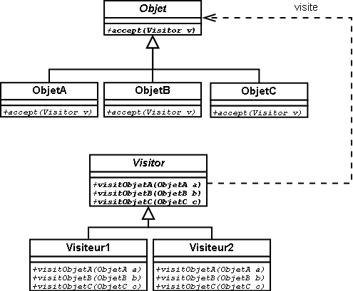
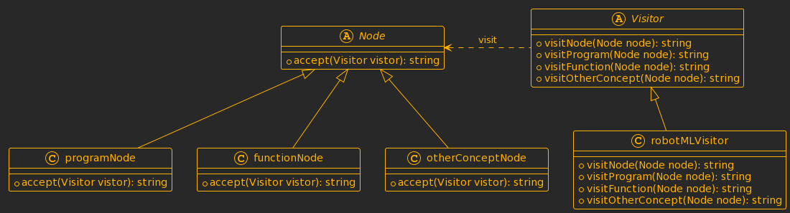
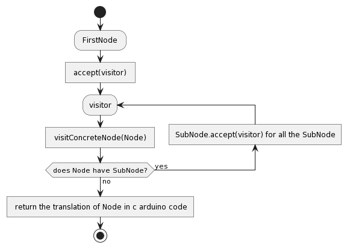

# ASE-kangora-wkone ( RoboML DSL)

## Overview

This project involves creating a Domain-Specific Language (DSL) for defining the behavior of a small robot. The DSL includes modeling the domain, implementing tooling such as a text editor, an interpreter (for a web-based simulator), and a compiler (for Arduino code).

### Domain Modeling with Ecore

In the first part of the project, we defined the language's metamodel using Ecore, which captures the abstract syntax of the DSL. The key concepts modeled include:

#### 1. **Program:**
   - **Description:** Represents the overall structure of a RobbotML program.
   - **Explanation:** A program consists of a set of functions that define the behavior of the robot. It serves as the root element of the language.

#### 2. **FunctionML:**
   - **Description:** Defines a function within the RobbotML language.
   - **Explanation:** Functions encapsulate reusable units of behavior. They include parameters, a return type, and a body containing a sequence of instructions.

#### 3. **Parameter:**
   - **Description:** Represents a parameter within a function definition.
   - **Explanation:** Parameters allow functions to receive input values, enhancing flexibility and reusability.

#### 4. **Block:**
   - **Description:** Defines a block of instructions within a function.
   - **Explanation:** A block groups multiple instructions together, providing a structured way to organize the logic of a function.

#### 5. **Instruction:**
   - **Description:** Represents a generic instruction within the RobbotML language.
   - **Explanation:** Instructions are the fundamental building blocks that define the behavior of the robot. They include commands, variable declarations, and assignments.

#### 6. **Affectation:**
   - **Description:** Represents an assignment operation within an instruction.
   - **Explanation:** Assigns a value to a variable, enabling the manipulation and storage of data during program execution.

#### 7. **Command:**
   - **Description:** Represents a command that controls the robot's movements or performs specific actions.
   - **Explanation:** Commands are essential for directing the robot's behavior. They include movement commands, control commands, and function calls.

#### 8. **MovementCommand:**
   - **Description:** Defines commands related to the robot's movement.
   - **Explanation:** Movement commands control the robot's translational and rotational motion.

#### 9. **ControlCommand:**
   - **Description:** Represents control flow commands such as if statements and loop commands.
   - **Explanation:** Control commands manage the flow of execution based on specified conditions or loops.

#### 10. **IfStatement:**
   - **Description:** Represents an if statement within the control flow.
   - **Explanation:** Allows conditional execution of a block of instructions based on a specified boolean condition.

#### 11. **LoopCommand:**
   - **Description:** Represents a loop statement within the control flow.
   - **Explanation:** Executes a block of instructions repeatedly as long as a specified condition holds true.

#### 12. **GetTimestampCommand:**
   - **Description:** Retrieves the timestamp and assigns it to a variable.
   - **Explanation:** Useful for time-related operations within the program.

#### 13. **GetDistanceCommand:**
   - **Description:** Retrieves the distance and assigns it to a variable.
   - **Explanation:** Enables the robot to measure and use distances in its computations.

#### 14. **FunctionCall:**
   - **Description:** Represents a call to another function within the program.
   - **Explanation:** Enables the reuse of code by invoking the behavior defined in other functions.

#### 15. **VariableDeclaration:**
   - **Description:** Declares a variable within the program.
   - **Explanation:** Variables are used for storing and managing data during program execution.

#### 16. **NumericExpression:**
   - **Description:** Represents expressions involving numeric values.
   - **Explanation:** Numeric expressions are fundamental for mathematical operations within the language.

#### 17. **BooleanExpression:**
   - **Description:** Represents expressions involving boolean values.
   - **Explanation:** Enables conditional branching and logical operations within the program.

#### 18. **UnitType:**
   - **Description:** Defines the unit type for distance measurements.
   - **Explanation:** Provides a standardized way to represent units such as centimeters (cm) or millimeters (mm).

#### 19. **DataType:**
   - **Description:** Represents data types such as boolean, number, or void.
   - **Explanation:** Specifies the type of data associated with variables, function return values, and parameters.

#### 20. **Expression:**
   - **Description:** Represents a generic expression within the RobbotML language.
   - **Explanation:** Expressions are used to define computations, whether numeric, boolean, or function calls.

The careful definition of these concepts in the metamodel allows for a clear and concise representation of the abstract syntax of RobbotML, fostering readability, maintainability, and extensibility of the DSL.
.

Below is the Ecore metamodel:


In this metamodel, classes such as `Movement`, `Rotation`, `Speed`, `Sensors`, etc., capture the essential concepts of the RoboML language.

## Textual Modeling with Langium

The second part focuses on defining the Langium grammar and editor for the DSL. We used the TypeScript-based Langium workbench to build a Visual Studio Code extension. This extension allows users to edit RoboML code with syntax highlighting and autocompletion.

### Interpreting RoboML Code

The interpreter is implemented in TypeScript and runs on a web-based simulator for the robot. It utilizes the visitor design pattern to traverse the Abstract Syntax Tree (AST) generated from parsed RoboML code. The interpreter simulates the robot's behavior according to the code.

### Compiling RoboML Code

#### Overview

The compiler translates RoboML code into Arduino code, enabling the robot to execute the specified behavior.
Ce compilateur resoud les problems suisvant :
* Reduire la complexité d'expression des programmes en de notre robot car ce language est facilement nanipulabre que le c arduino code.
* Avoir du code c arduino optimisé pour nos robots. En effet il n'est pas evident aux non specialistes d'ecrire du code optimisé dans les languages de bas niveaux.

#### Principle of implementation

##### pattern visitor



Le pattern visiteur est un patron qui permet de separer la structure de donnée et l'algorithm qui lui sera appliqué. Ainsi on separe les preocupations d'evolutions de la structure de donnée et l'algorithm. Chacun des deux entités peuvent evoluer de façon independante sans s'impacté mutuellement.
En pratique la mise en place du pattern visiteur fait intervenir deux entités :
* les classes à visiter : ce sont les structures de données (les classes) sur lesquelles on doit appliquer des algorithms. En principe de la POO, les algorithms sont sensés se trouver dans ces classes directement et dans ce cas l'evolution des algorithms implique la modification de des classes (ce que l'on veut justement eviter car les classes sont souvent fermées c'est à dire pas accessible au developpeur des algorithms)
* l'interface visiteur : qui permet definit les methodes de visite de chaque chaque structure données. Il s'agit des methodes qui contiendrons les algorithm à appliquer à chaque structure de donnée.
L'interface permet de decoupler les methodes de leurs implementation. Ce qui permet de faire evoluer les implementations sans regression sur les classes qui utilisent l'interface qui definit les methodes.
* le visiteur concret : c'est une implementation de l'interface visiteur qui va permettre de donner une implementation de chaque methode de visite.

##### class extention
L'extention de classe permet d'ajouter une nouvelle methode à un un objet de façon dynamique (sans ajouté la methode au niveau de la classe de l'objet).
Cela peur etre util pour ajouter de nouvelle methode à un objet d'une classe fermée (une classe dont on pas accès au code) ou une classe dont on ne veut pas modifier le code.

##### Mise en place du pattern visiteur pour notre compilateur



Dans le cadre de notre compilateur, les structrures de donnés ou encore classe à visiter sont les differents concepts de notre classe.
Dans l'interface visiteur on definit les methodes de visite de chaque concepts. Dans les visiteurs concrets, on donne une implement de ces methodes qui traduise le concept visiter en son concept equivalent du language c arduino.
Les classe concepts sont generés par languim automatiquement. ce qui fait que ces classes sont fermées pour nous. On utilise donc le mecanisme d'extention de classe pour ajouter dynamiquement les accept(visitor) à ces classes concepts .
##### Ast parse diagram with visitor pattern



On commence par traduire notre program robotML code en ast (arbre de syntaxique ) dont les noeuds sont les differents concepts de notre languages robotML.
ensuite on appelle la methode ast.accept(visitor) sur le premier noeud qui dont la referrence est ast.
Par suite cette methode accept(visitor) nous ramene dans la methode visitConcretNode(ConcretNode).
Dans cette methode on execute la traduction du concretNode puis de maniere recursive on appelle la methode accept(visitor) sur tous les nodes fils du node ConcreteNode.
Ainsi à partir du premier nodes tous les nodes sont visiter recurivement.

#### Resultats

##### Fichiers contenants l'implementations du compilateur

* src/semantics/visitor.ts qui ce fichier contient :
la declaration de notre interface visitor :

```node
export interface RoboMLVisitor {
    visitProgram(node: ASTInterfaces.Program): any;
    visitFunctionML(node: ASTInterfaces.FunctionML): any;
   ...
}
```

l'implementation des classe concretes des concepts:
```node
export class Program implements ASTInterfaces.Program {  
   ...
}
...
//
export class FunctionML implements ASTInterfaces.FunctionML{
   ...
}
```

* src/semantics/compiler.ts which contains :
The implementation of robotML visitor for compilation:
```node
export class ConcreteVisite implements RoboMLVisitor{
    //ici je dois implementer toute les methodes de l'interface roboMLVisitor
    visitProgram(node: Program): any {
      ...
   }
   ...
}
```
* src/semantics/accept-weaver.ts:
contains the accept-weaving class which is the class that extend concepts class to add the accept method dynamically
```node
 */
export class RoboMlAcceptWeaver {
    weaveProgram(node : InterfaceAST.Program, accept : ValidationAcceptor) : void{
      ...
      }
    weaveFunctionML(node : InterfaceAST.FunctionML, accept : ValidationAcceptor) :void{ 
      ...
    }
   ...
    checks: ValidationChecks<RobbotMlAstType> = {
        Program : this.weaveProgram,
        FunctionML : this.weaveFunctionML,
         ...
      }
   }

```
* src/cli/main.ts 
this file contains our main function in which we start the compilation by reading the robotML file :
```node
//Fonction that parseAndCompile the robotMLcode code to c arduino code
export const parseAndCompile = async (fileName: string): Promise<void> => {

    const services = createRobbotMlServices(NodeFileSystem).RobbotMl;
    const ast = await extractAstNode<Program>("program.rob",services) ;
    const visite = new ConcreteVisite() ;
    let compilation_result = ast.accept(visite);
    //
    writeInFile("./CompilationOutput/compiled_robot_code",compilation_result) ;
};
```

##### Points non terminés

- Nous avons fixer le nom du programme a compiler dans la fonction main à cause d'une erreur qu'on rencontre à ce niveau . Plus tard ce fichier sera passé en invite de commande lors de l'appel de compilateur
- Nous fixer aussi le resultat de compilation de ASE-KANGORA-WKONE/CompilationOutput/compiled_robot_code.c
- Nous avons mis un stub au niveau du concepts expression numerique car on arrive pas à recuperer la valeur constante lorsque l'expression numerique est une constante

## Demo

#### Compilator

- The robotML program :
```
let void entry () {
    setSpeed(150 mm)
    var number count = 0
    loop count < 5
    {	
        count = count + 1
        square()
    }
}

let void square(){
    Forward 30 cm
    Clock 90
    Forward 300 mm
    Clock 90
    Forward 30 cm
    Clock 90
    Forward 300 mm
    Clock 90
}
```
- Execution of the programme
```
wke@P204linux:~/Bureau/Scool_Project/ASE-kangora-wkone$ ./compile.sh 
**********************Building****************************

> robbot-ml@0.0.1 build
> tsc -b tsconfig.json && node esbuild.mjs

[01:56:28] Build succeeded
**********************Generating the binary of compilation function****************************
[sudo] Mot de passe de wke : 

> robbot-ml@0.0.1 langium:generate
> langium generate

Reading config from langium-config.json
src/language/Terminals.langium:2:34 - Consider using regex instead of character ranges
src/language/Terminals.langium:2:46 - Consider using regex instead of character ranges
src/language/Terminals.langium:2:64 - Consider using regex instead of character ranges
src/language/Terminals.langium:2:76 - Consider using regex instead of character ranges
src/language/Terminals.langium:2:94 - Consider using regex instead of character ranges
src/language/Terminals.langium:3:29 - Consider using regex instead of character ranges
Writing generated files to /home/wke/Bureau/Scool_Project/ASE-kangora-wkone/src/language/generated
Writing textmate grammar to /home/wke/Bureau/Scool_Project/ASE-kangora-wkone/syntaxes/robbot-ml.tmLanguage.json
Writing monarch grammar to /home/wke/Bureau/Scool_Project/ASE-kangora-wkone/syntaxes/robbot-ml.monarch.ts
Langium generator finished successfully in 175ms
**********************Compilation Result****************************
**visiting Program**
**visiting FunctionML entry**
**visiting block**
**visiting MovementCommand SetSpeedCommand ***
**visiting SetSpeedCommand ***
**visiting variable declararion ***
**visiting Expression NumericExpression***
**visiting LoopCommand ***
**visiting Expression NumericExpression***
**visiting instruction Affectation ***
**visiting Affectation ***
**visiting FunctionCall square ***
**visiting FunctionML square**
**visiting block**
**visiting Expression NumericExpression***
**visiting Expression NumericExpression***
**visiting Expression NumericExpression***
**visiting Expression NumericExpression***
**visiting Expression NumericExpression***
**visiting Expression NumericExpression***
**visiting Expression NumericExpression***
**visiting Expression NumericExpression***
```
- The compilation result
```c
//----------compiling robot code to c arduino code result----------

#include <PinChangeInt.h>
#include <PinChangeIntConfig.h>
#include <EEPROM.h>
#define _NAMIKI_MOTOR    //for Namiki 22CL-103501PG80:1
#include <fuzzy_table.h>
#include <PID_Beta6.h>
#include <MotorWheel.h>
#include <Omni4WD.h>

//#include <fuzzy_table.h>
//#include <PID_Beta6.h>

/*

            \                    /
   wheel1   \                    /   wheel4
   Left     \                    /   Right


                              power switch

            /                    \
   wheel2   /                    \   wheel3
   Right    /                    \   Left

*/

/*
  irqISR(irq1,isr1);
  MotorWheel wheel1(5,4,12,13,&irq1);

  irqISR(irq2,isr2);
  MotorWheel wheel2(6,7,14,15,&irq2);

  irqISR(irq3,isr3);
  MotorWheel wheel3(9,8,16,17,&irq3);

  irqISR(irq4,isr4);
  MotorWheel wheel4(10,11,18,19,&irq4);
*/

irqISR(irq1, isr1);
MotorWheel wheel1(3, 2, 4, 5, &irq1);

irqISR(irq2, isr2);
MotorWheel wheel2(11, 12, 14, 15, &irq2);

irqISR(irq3, isr3);
MotorWheel wheel3(9, 8, 16, 17, &irq3);

irqISR(irq4, isr4);
MotorWheel wheel4(10, 7, 18, 19, &irq4);


Omni4WD Omni(&wheel1, &wheel2, &wheel3, &wheel4);

void setup() {
  //TCCR0B=TCCR0B&0xf8|0x01;    // warning!! it will change millis()
  TCCR1B = TCCR1B & 0xf8 | 0x01; // Pin9,Pin10 PWM 31250Hz
  TCCR2B = TCCR2B & 0xf8 | 0x01; // Pin3,Pin11 PWM 31250Hz

  Omni.PIDEnable(0.31, 0.01, 0, 10);
}

void loop() {
  Omni.demoActions(30,1500,500,false);

}


void main(){

  setSpeedMMPS(2 mm);
  number count = 35;
  while(count<=35){
      count=2;;
      square();
    };
};

void square(){

  int speed = getSpeedMMPS() ;
  float distance = 35;
  unsign int time =  distance/speed ;
  runTime(speed,0,time);

  int speed = getSpeedMMPS() ;
  float distance = 35;
  unsign int time =  distance/speed ;
  runTime(speed,1,time);

  int speed = getSpeedMMPS() ;
  float distance = 35;
  unsign int time =  distance/speed ;
  runTime(speed,0,time);

  int speed = getSpeedMMPS() ;
  float distance = 35;
  unsign int time =  distance/speed ;
  runTime(speed,1,time);

  int speed = getSpeedMMPS() ;
  float distance = 35;
  unsign int time =  distance/speed ;
  runTime(speed,0,time);

  int speed = getSpeedMMPS() ;
  float distance = 35;
  unsign int time =  distance/speed ;
  runTime(speed,1,time);

  int speed = getSpeedMMPS() ;
  float distance = 35;
  unsign int time =  distance/speed ;
  runTime(speed,0,time);

  int speed = getSpeedMMPS() ;
  float distance = 35;
  unsign int time =  distance/speed ;
  runTime(speed,1,time);

};
```
#### Interpretor
Watch a demo of the RoboML DSL project in action [here](link/to/demo/video).

## Summary and Challenges

In summary, this project involved creating a DSL for robot behavior, including domain modeling, textual modeling, interpretation, and compilation. Challenges encountered during development included...

#### Compilator
We have face a lot of challence in this developpement of the compilator:

- The understanding of the visitor pattern which was very vague for us at the beginning but the project allowed us to understand its implementation and the problems to which it responds in particular the implementation of algorithms on closed classes (class to which we do not have access to code)
- The traversal of our Abstract Syntax Tree (AST) with the Visitor pattern involved contemplating where to start and how to navigate the tree. We realized that each node in the tree has its subnodes and requires the translation of its subnodes to obtain its own translation. This insight allowed us to establish the tree traversal model."
- We faced other challenges such as correcting circularity errors where the program loops between Node.accept(visitor) and visitor.visitCroncreteNode(Node)

#### Interpretor
- Challenge 1
- Challenge 2
- ...

Feel free to explore the project, try out the DSL, and contribute to its improvement!

**Note:** Add any specific instructions or additional details based on your project's unique aspects.
